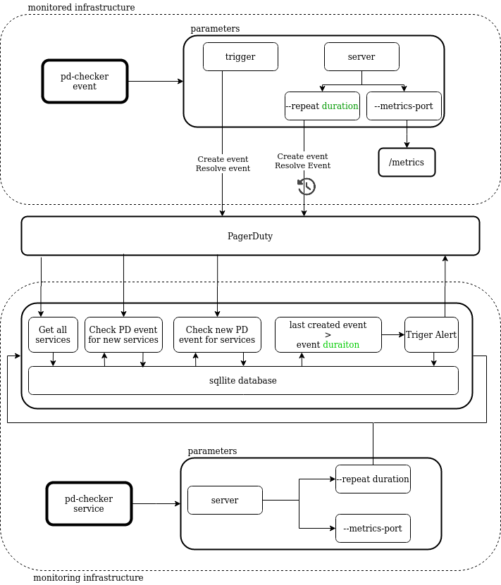

- [Architecture overview](#architecture-overview)
- [pd-checker service](#pd-checker-service)
	- [Description](#description)
	- [Database structure](#database-structure)
	- [Usage](#usage)
		- [CLI](#cli)
		- [Docker](#docker)
	- [Metrics](#metrics)
- [pd-checker event](#pd-checker-event)
	- [Description](#description-1)
	- [Usage](#usage-1)
		- [CLI](#cli-1)
		- [Docker](#docker-1)
	- [Metrics](#metrics-1)
- [FAQ](#faq)
	- [New PagerDuty service was added how to refresh pd-checker service database](#new-pagerduty-service-was-added-how-to-refresh-pd-checker-service-database)
	- [pd-checker service container service was recreated and sqlite database was lost](#pd-checker-service-container-service-was-recreated-and-sqlite-database-was-lost)
	- [How often pd-checker service will be trigger PagerDuty alert on not working integration](#how-often-pd-checker-service-will-be-trigger-pagerduty-alert-on-not-working-integration)
	- [How add PagerDuty service to pd-checker](#how-add-pagerduty-service-to-pd-checker)
# Architecture overview
Main idea behind this program is to test _PagerDuty_ integration on your infrastructure.



# pd-checker service
## Description
`pd-checker service` is a master process that run on your monitoring infrastructure (outside of the monitored infrastructure).
Main purpose of this command is to scanning all PagerDuty services for a specific pd-checker event and trigger alert if such incident not occurred after defined time. 

`pd-checker service` to integrate with PagerDuty required [user auth token](https://support.pagerduty.com/docs/generating-api-keys#section-rest-api-keys).

Can be used as [cli](#cli) command or [docker](#docker) service

## Database structure
`pd-checker service` lists incidents for all available services and save to the database last incident per service created by the `pd-checker event`.
If incident for given service already exist it will only update `ID`, `Title`, `CreateAt` and `Timer` values. 
```
//Incident structure for incidents stored in database
type Incident struct {
	ID          string // PagerDuty incident ID
	Title       string // PagerDuty incident title
	ServiceID   string // PagerDuty service ID related to created incident
	ServiceName string // PagerDuty service name related to created incident
	CreateAt    string // PagerDuty incident creation time
	Timer       string // PagerDuty additional information defined by pd-checker event details informtion
	Alert       string // If "Y" create new alert for service
	ToCheck     string // If "Y" check for new incidents 
	Trigger     string // If "Y" alert already triggered
}
```

All available PagerDuty services are stored in `Service` database.
```
//Service structure for service stored in database
type Service struct {
	ID   string // PagerDuty service ID related to created incident
	Name string // PagerDuty service name related to created incident
}
```

## Usage
### CLI
Set PagerDuty user auth token using environment variable 
```
	export PAGERDUTY_AUTH_TOKEN=xxx
```


Run pd-checker service with default parameters (check all services for new alerts every 6h)
```
pd-checker service server
```


Run pd-checker service for every 24h for scanning services and checking new alerts
```
pd-checker service server -t 24h
```
### Docker
Can be used as docker service (preferred way)
Pull image from docker hub
```
docker pull jlubzinski/pd-checker
```

Prepare [docker compose](deployments/docker-compose-service.yml) and define `PAGERDUTY_AUTH_TOKEN` 
## Metrics

# pd-checker event
## Description
`pd-checker-event` trigger (from inside of your infrastructure) and instantly resolve single Pagerduty incident always with the same payload:
```
Summary:  "PD CHECKER - OK",
Severity: "info",
Source:   "localhost",
Details:  triggerEvery,
```

New event can be create manually or in server mode every _triggerEvery_ time.

Next pd-checker-service will scan all available services every _triggerEvery_ time and if found new event with name _PD CHECKER - OK_ register them in local database 

To integrate with PagerDuty required [Events API v2 service integration](https://support.pagerduty.com/docs/services-and-integrations#events-api-v2).

## Usage
### CLI
Set PagerDuty integration key using environment variable 
```
	export PAGERDUTY_INTEGRATION_KEY=xxx
```


Run `pd-checker event` with default parameters (trigger/resolve new alert every 12h )
```
pd-checker event server
```


Run `pd-checker event` trigger/resolve new alert every 12h
```
pd-checker service event -r 12h
```
### Docker
Can be used as docker service (preferred way)
Pull image from docker hub
```
docker pull jlubzinski/pd-checker
```

Prepare [docker compose](deployments/docker-compose-event.yml) and define `PAGERDUTY_INTEGRATION_KEY` 
## Metrics
# FAQ
## New PagerDuty service was added how to refresh pd-checker service database
`pd-checker service` on every 12h (default) scan for new PagerDuty service and add them to sqlite database
## pd-checker service container service was recreated and sqlite database was lost
`pd-checker service` on initial run scan for all PagerDuty services and add them to sqlite database
## How often pd-checker service will be trigger PagerDuty alert on not working integration
`pd-checker service` trigger real PagerDuty alert only once and keep information about triggered alerts in sqlite database
## How add PagerDuty service to pd-checker
Add `pd-checker event` to new monitored infrastructure. Next every 12h (default) new pd-checker event will be created. `pd-checker service` add new service after scan new alert

TODO:
- check if alert was already triggered on PagerDuty
